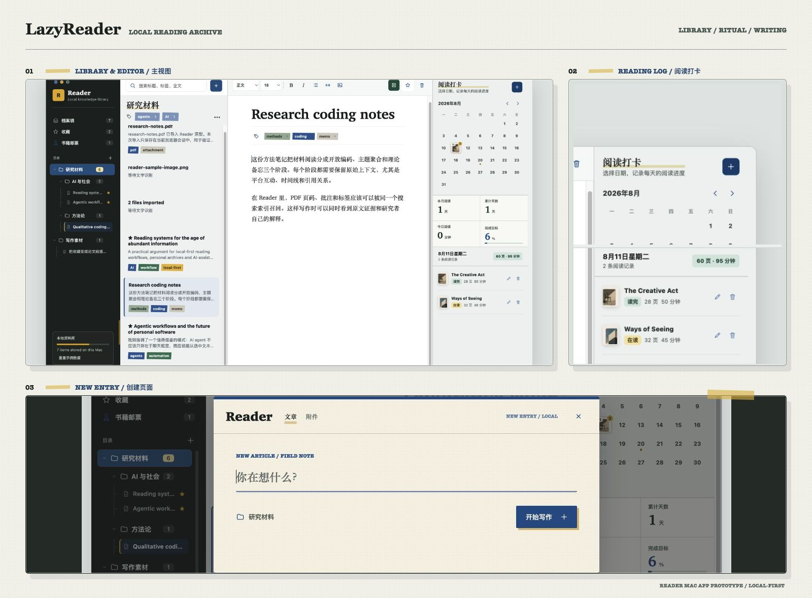

# LazyReader



## Intro(en)

LazyReader is a local-first Reader Mac App prototype for collecting, organizing, reading, editing, and AI-processing research materials. It is currently a self-contained HTML prototype with a local Node proxy for DeepSeek calls.

### Highlights

- **Local-first reading library**: Manage URLs, attachments, Markdown notes, RSS previews, folders, tags, favorites, and filters in one workspace.
- **Real prototype state**: Folder creation, article deletion, favorite toggling, type filters, live counts, and `localStorage` persistence are implemented.
- **Attachment ingestion**: Import images, PDFs, and videos through a pending-import flow; multiple files create multiple library items.
- **OCR-oriented image workflow**: Image imports can produce OCR text, marked/highlighted text extraction results, manual correction, and editable OCR sections.
- **Editable reading objects**: Each item supports read/edit/notes modes. OCR results are editable rather than locked inside an image preview.
- **AI-assisted reading flow**: Sidebar chat, Cmd+K commands, selection actions, summaries, translations, rewrites, and related-material actions are wired into the reading context.
- **Safer AI proxy design**: DeepSeek API keys are not stored in frontend code or browser storage. The local proxy reads `DEEPSEEK_API_KEY` from the environment.

### Project Files

- `Reader Mac App Prototype.html` — the interactive prototype and browser-side state.
- `reader-ai-proxy.mjs` — local text-only proxy for DeepSeek chat completion tasks.
- `_d_meta.json` — design prototype metadata.
- `assets/preview.png` — README preview image.

### Run Locally

Serve the prototype over HTTP from the parent folder:

```bash
python3 -m http.server 4318 --directory ..
```

Open:

```text
http://127.0.0.1:4318/reader-mac-app/Reader%20Mac%20App%20Prototype.html
```

Optional: start the DeepSeek proxy:

```bash
DEEPSEEK_API_KEY="<your-key>" node reader-ai-proxy.mjs
```

Then use the AI sidebar, command palette, or selection actions in the prototype.

### Current Limitations

- This is not yet a packaged native Mac app.
- URL fetching, RSS subscription, and social-media ingestion are mock flows.
- Files are not copied into a real local file store.
- Persistent data uses browser `localStorage`, not SQLite/Core Data.
- OCR depends on browser-side Tesseract loading and image quality.
- A browser-only prototype cannot auto-start the local DeepSeek proxy; that requires Electron, Tauri, or Swift.

### Next Engineering Steps

- Wrap the prototype in Electron, Tauri, or Swift for native Mac capabilities.
- Replace `localStorage` with SQLite/Core Data.
- Add real local file import, storage, deletion, and search indexing.
- Store API keys in macOS Keychain.
- Auto-start the AI helper from the native app layer.
- Replace mock URL/RSS ingestion with real parsers and background jobs.

---

## 介绍（中）

LazyReader 是一个本地优先的 Reader Mac App 原型，用于采集、整理、阅读、编辑和 AI 处理研究资料。当前版本是一个自包含 HTML 交互原型，并带有一个用于调用 DeepSeek 的本地 Node 代理。

### 功能亮点

- **本地优先资料库**：在同一个工作区中管理 URL、附件、Markdown 笔记、RSS 预览、文件夹、标签、收藏和筛选。
- **真实原型状态**：已实现文件夹创建、文章删除、收藏切换、类型筛选、真实数量统计和 `localStorage` 持久化。
- **附件导入流程**：支持图片、PDF、视频的待导入状态；多文件导入会创建多条资料卡。
- **面向 OCR 的图片工作流**：图片导入后可以进入 OCR、画线/高亮文字提取、手动修正和可编辑 OCR 文本流程。
- **可编辑阅读对象**：每条内容都有阅读、编辑、笔记模式。OCR 结果会进入可编辑文本，而不是只保留在图片里。
- **嵌入式 AI 阅读流程**：AI 侧栏、Cmd+K、选区操作、摘要、翻译、改写和关联资料都围绕当前阅读上下文工作。
- **更安全的 AI 代理设计**：DeepSeek API key 不写入前端代码或浏览器存储；本地代理只从 `DEEPSEEK_API_KEY` 环境变量读取。

### 项目文件

- `Reader Mac App Prototype.html` — 交互原型和浏览器端状态逻辑。
- `reader-ai-proxy.mjs` — DeepSeek 文本任务的本地代理。
- `_d_meta.json` — 设计原型元数据。
- `assets/preview.png` — README 预览图。

### 本地运行

从父目录启动 HTTP 服务：

```bash
python3 -m http.server 4318 --directory ..
```

打开：

```text
http://127.0.0.1:4318/reader-mac-app/Reader%20Mac%20App%20Prototype.html
```

可选：启动 DeepSeek 本地代理：

```bash
DEEPSEEK_API_KEY="<your-key>" node reader-ai-proxy.mjs
```

然后即可在原型中使用 AI 侧栏、命令菜单或选区操作。

### 当前限制

- 当前还不是已打包的原生 Mac App。
- URL 抓取、RSS 订阅、社交媒体采集仍是 mock 流程。
- 文件还没有复制到真实本地资料库。
- 持久化数据使用浏览器 `localStorage`，不是 SQLite/Core Data。
- OCR 稳定性依赖浏览器端 Tesseract 加载和图片质量。
- 纯浏览器原型不能自动启动本地 DeepSeek proxy；这需要 Electron、Tauri 或 Swift 原生层。

### 后续工程方向

- 使用 Electron、Tauri 或 Swift 封装成原生 Mac App。
- 用 SQLite/Core Data 替代 `localStorage`。
- 增加真实本地文件导入、存储、删除和搜索索引。
- 将 API key 存入 macOS Keychain。
- 由原生层自动启动 AI helper。
- 用真实解析器和后台任务替换 mock URL/RSS 流程。
